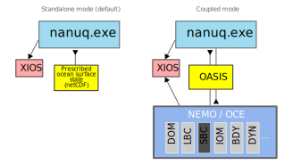
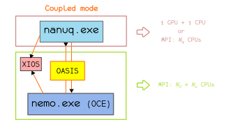
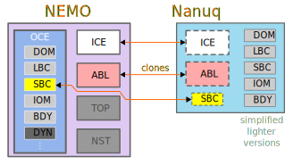

# NANUQ: a standalone GPU-optimized fork of NEMO/SI3 featuring brittle rheologies

NANUQ is a fork of SI3+SBC, namely the _sea-ice_ + _ocean surface boundary conditions_ components of NEMO version 5.

Put simply, NANUQ is a standalone executable that computes the surface fluxes expected by the 3D liquid ocean as surface boundary conditions (momentum, heat & mass), in the presence of sea-ice or not.
As part of this, it resolves sea-ice dynamics and thermodynamics and can be used for the two following purposes:
- Standalone sea-ice experiments: NANUQ is provided with both a prescribed surface liquid ocean state and a surface atmospheric state (as netCDF files).
- Coupled ocean/sea-ice experiments: NANUQ is provided with a prescribed surface atmospheric state (as netCDF files) and receives the surface (liquid) ocean state from an ocean model (via OASIS); in return, NANUQ sends (via OASIS) the surface fluxes of momentum, (solar and non-solar) heat and freshwater (E-P) to be used as surface boundary conditions by the ocean model (over BOTH ice-free and ice-covered regions).

<p align="center">
  
</p>

With respect to the current version of SI3, NANUQ allows to use:
- the BBM brittle rheology, including the damage tracer, of [Òlason _et al._, 2022](https://doi.org/10.1029/2021MS002685), implemented in SI3 by [Brodeau _et al._, 2024](https://doi.org/10.5194/gmd-17-6051-2024).
- the WENO advection scheme (for ice) of order 5 & 7, fully generalized for orthogonal curvilinear grids !
- 5th order symmetric WENO interpolation for remapping between the C-grid point (such as from center to corner grid points for example).

Currently, NANUK can efficiently offload on a single GPU using OpenACC
directives. These directives are present in the code and are used in
combination with the `_OPENACC` preprocessing key.
As such, apart from the initialization, restart reading/writing & I/O, all computation is performed on the GPU.
It has been extensively tested with the `nvfortan` compiler of Nvidia (ex PGI).

<p align="center">
  
</p>


<br>

## Motivation behind NANUQ
Technically, NANUQ is the equivalent of the SAS (StandAlone Surface) setup of NEMO, which can be run both in a standalone fashion (feeding on a prescribed surface state of the liquid ocean) or coupled to OCE (the 3D "liquid-ocean-only" component of NEMO) via OASIS.

First, we believe in modularity, and the great sea-ice component that SI3 is deserves to be "accessible", "usable", and "tweakable" without the hassle of diving in the vast and intimidating ecosystem of NEMO.
As such, NANUQ is stripped from all possible unnecessary source code, dependencies, and run-time operations that are present in SAS.

When attempting to use SI3 (or rather SAS) as a standalone _sea-ice only_ component, users may face the following issues and limitations.

* 1/ SI3 is completely entangled within NEMO:
- SI3 code is dependent on many NEMO modules that are liquid-ocean-specific, which requires the compilation of the whole NEMO code source when using it in a standalone mode via SAS
- when it comes to performance, many unnecessary liquid-ocean-specific 3D and 2D arrays are allocated, and some unnecessary ocean-specific operations are performed during runtime, which greatly increases the memory usage compared to that of NANUQ

A standalone sea-ice GCM such as NANUQ, rid of all liquid ocean code, comes also really handy when porting and optimizing the sea-ice code to/for GPU! We aim at completely porting NANUQ to GPU using OpenACC and/or OpenMP directives. The idea is to target a mode of use on hybrid HPC nodes, on which NANUQ runs on a GPU and is coupled to an OCE of NEMO (via OASIS) running on CPU cores (MPI).


<br>

## Code architecture under `src/`

Remaining from NEMO:
- `BDY` lateral open boundary conditions for sea-ice
- `DOM` spatial domain/grid...
- `ICE` sea-ice model (ex SI3)
- `IOM` XIOS I/O interface
- `LBC` horizontal MPI partitioning of the computation domain...
- `SBC` surface boundary conditions for sea-ice and liquid ocean
- `ABL` atmospheric boundary layer

<p align="center">
  
</p>


New / renamed:
- `OSS`: Ocean Surface State stuff, provides the fields (prescribed or coupled) that serve as bottom boundary conditions for the sea-ice model and/or are used to compute air-sea fluxes over open (liquid) ocean
- `sbcssm.F90` has become `ossssm.F90` (read a prescribed surface state of the ocean: SST, SSS, SSH, SSU, SSV, etc)
- `osscpl.F90` (new) a version of `sbccpl.F90` dedicated only to the OSS coupling realm...

<br>

## Compilation of the "nanuq.exe" executable

As of now, this guide is written for someone familiar with the compilation of NEMO.

Just as for NEMO, compilers, compilation flags, MPI paths, as well as the path to the XIOS2 library and executables must be defined in the `arch/arch-<ARCH>.fcm` (standalone executable) or in the `arch/arch-<ARCH>_OA3.fcm` (coupled executable).
`<ARCH>` being the string that identifies the host on which NANUQ is compiled.

### For standalone simulations

Compilation of a `nanuq.exe` executable that will require a prescribed surface (liquid) ocean state to be provided as netCDF files.

To compile the executable:

``` ./makenanuq -m <ARCH> -r generic -j 4```

Executable created: `cfgs/generic/BLD/bin/nanuq.exe`


### For coupled simulations with OASIS-MCT

Compilation of a `nanuq.exe` executable that is intended to receive the prognostic surface (liquid) ocean computed by an OGCM and send back surface boundary conditions to this OGCM.

First, you need to have a XIOS2 installation that has been compiled with OASIS-MCT support. So the first thing to compile is OASIS-MCT!

Note:
In coupled mode, the OGCM receives the `E-P` freshwater flux from NANUQ, the contribution from continental runoffs is something the OGCM has to handle itself.
With OCE of NEMO: `ln_rnf=T` and the `namsbc_rnf` namelist block filled, with a netCDF runoff climatology provided...

#### Install OASIS3-MCT

```git clone https://gitlab.com/cerfacs/oasis3-mct.git```
`...`

#### install XIOS2 trunk
Then, compile XIOS2 with OASIS support:
```svn co http://forge.ipsl.jussieu.fr/ioserver/svn/XIOS2/trunk xios2-trunk_oa3```

Adjust your `arch/arch-<ARCH>_OA3.fcm` with the paths to OASIS and this OASIS-linked XIOS.


#### compile the `nanuq.exe`

``` ./makenanuq -m <ARCH>_OA3 -r generic_cpl_oce -j 4```

Executable created: `cfgs/generic_cpl_oce/BLD/bin/nanuq.exe`


<br>

## Getting started with NANUQ

Download the archive containing input and forcings for the test-cases [here](https://ige-meom-opendap.univ-grenoble-alpes.fr/thredds/fileServer/meomopendap/extract/SASIP/model-forcings/nanuq/INPUT_NANUQ_DISTRIB.tgz).

And extract it somewhere...

`tar zxvf INPUT_NANUQ_DISTRIB.tgz`

If you plan to test the HUDSON12 setups (standalone or coupled to OCE of NEMO), also download the atmospheric forcing:
[here](https://ige-meom-opendap.univ-grenoble-alpes.fr/thredds/catalog/meomopendap/extract/SASIP/model-forcings/nanuq/ERA5-HUDSON12/catalog.html) (16 GiB!).
<br>
It is the 1-hourly ERA5 surface atmospheric forcing for 1997 interpolated on the HUDSON12 domain, 1 netCDF file per atmospheric variable.

Similarly, for the EGL12 setups, the required atmospheric forcing files can be downloaded [here](https://ige-meom-opendap.univ-grenoble-alpes.fr/thredds/catalog/meomopendap/extract/SASIP/model-forcings/atmo_forcing/ERA5_Arctic/catalog.html).

<br>

## Standalone mode (sea-ice-only) configurations

By increasing order of realism/complexity...

### The `ROTATION` 2D-advection-only idealized test case
This test-case is dedicated to the comparison of the various
horizontal advection schemes available in NANUQ, namely _SOM (aka
Prather)_, _WENO 7th order_ & _Ultimate Macho 5th order_.  A circular
patch of sea-ice is advected by a cyclonically-rotating prescribed
analytical horizontal velocity field.

Both thermodynamics and rheology components of NANUQ are deactivated
in such an idealized 2D-advection-only setup (`ln_dynADV2D=.true.` in the
NANUQ ice `&namdyn` namelist block).

<p align="center">
  
</p>

_Advection of a 30 cm thick circular patch of ice on a 500 km wide
domain during 90 days (field shown: ice thickness; max velocity of the cyclonic vortex: 0.25 m/s)
at 2 km of resolution. SOM (Prather) scheme [left] and WENO 7
[right]._


<br>


<p align="center">
  
</p>

_Same after 5 months of simulation._

See the dedicated [README](./tests/ROTATION/README.md) under `./tests/ROTATION/`.


<br>


### The `CYCLONE` idealized test case
Test-case of Melhmann _et al._, 2021.

This test case, defined on a 512 km wide square domain, simulates a
cyclone traveling in the northeastward direction over a thin layer of
ice (h ≃ 0.3 m) that floats on an anticyclonically circulating
ocean. This test case is well suited to illustrate the influence of
the grid discretization on rheology-related processes such as the
representation of linear kinematic features (LKFs)

<p align="center">
  
</p>

_Evolution of the sea ice concentration during 3 days at 2 km of resolution using 2 different sea-ice rheologies: aEVP (default in SI3) [left] and the BBM brittle rheology [right]._

See the dedicated [README](./tests/CYCLONE/README.md) under `./tests/CYCLONE/`.


<br>

### The `CHANNELD17` idealized test case

Test-case of Dansereau _et al._, 2017. An idealized setup of the Nare straight under vigorous northerly wind forcing.

<p align="center">
  
</p>

_Evolution of the sea ice thickness (initially 1 m) during 10 days at 2 km of resolution under constant northerly wind forcing of 20 m/s._


See the dedicated [README](./tests/CHANNELD17/README.md) under `./tests/CHANNELD17/`.


<br>


### The `HUDSON12` (sea-ice only) realistic test case

Regional configuration of the HUDSON bay at 12th of a degree of spatial resolution (extracted from eORCA12).

<!--
<p align="center">
<video width="225" controls>
<source src="https://github.com/user-attachments/assets/5507bdc9-aee2-4ba9-bc75-115abc1fac31" type="video/mp4">
</video>
</p>
-->

https://github.com/user-attachments/assets/08c848fe-4d7a-4f3a-93f5-6dd61db39f01

_Evolution of the sea ice thickness (range: 0 - 3m), 1996-11-01 to 1997-05-20 with the aEVP (left) and the BBM (right) rheologies in the HUDSON12 coupled setup (NANUQ - OASIS -NEMO/OCE) with hourly ERA5 surface atmospheric forcing. Initialized 1996-11-01 with GLORYS2v4 reanalysis._


https://github.com/user-attachments/assets/5507bdc9-aee2-4ba9-bc75-115abc1fac31

_Evolution of the sea ice damage during 60 days with the BBM rheology (January & February 1997) in HUDSON12 with hourly ERA5 surface atmospheric forcing._

See the dedicated [README](./tests/HUDSON12/standalone/README.md) under `./tests/HUDSON12/standalone`.


<br>


### The `EGL12` (sea-ice only) realistic test case under prescribed (open) lateral boundary conditions (BDY)

Regional configuration of the East-Greenland region at 12th of a degree of spatial resolution (extracted from eORCA12).

https://github.com/user-attachments/assets/02d6799b-6e82-47bc-95cd-03e54171d8f8

_Evolution of the sea ice thickness (range: 0 - 4m), 1997-01-01 to 1997-04-25 with the BBM rheology in the EGL12 coupled setup (NANUQ - OASIS -NEMO/OCE) with hourly ERA5 surface atmospheric forcing. Initialized 1997-01-01 with GLORYS2v4 reanalysis. White rectangular area are disregarded processors regions (MPI horizontal decomposition)._

See the dedicated [README](./tests/EGL12/standalone/README.md) under `./tests/EGL12/standalone`.


<br>


## NANUQ coupled to OCE of NEMO

### The HUDSON12 (ocean/sea-ice coupled) realistic test case
See the dedicated [README](./tests/HUDSON12/cpl_oce/README.md) under `./tests/HUDSON12/cpl_oce`.

### The EGL12 (ocean/sea-ice coupled) realistic test case with prescribed (open) lateral boundary conditions
See the dedicated [README](./tests/EGL12/cpl_oce/README.md) under `./tests/EGL12/cpl_oce`.


<br>

<br>

Remember my friend (totally out of context but important):

    ! * jperio= 0, landlocked
    ! * jperio= 1, CYCLIC east-west
    ! * jperio= 2, equatorial symmetric (i.e. CYCLIC north-south)
    ! * jperio= 3, north fold WITH T-point pivot
    ! * jperio= 4, CYCLIC east-west and north fold WITH T-point pivot
    ! * jperio= 5, north fold WITH F-point pivot
    ! * jperio= 6, CYCLIC east-west and north fold WITH F-point pivot
    ! * jperio= 7, CYCLIC east-west and north-south
