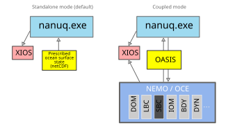
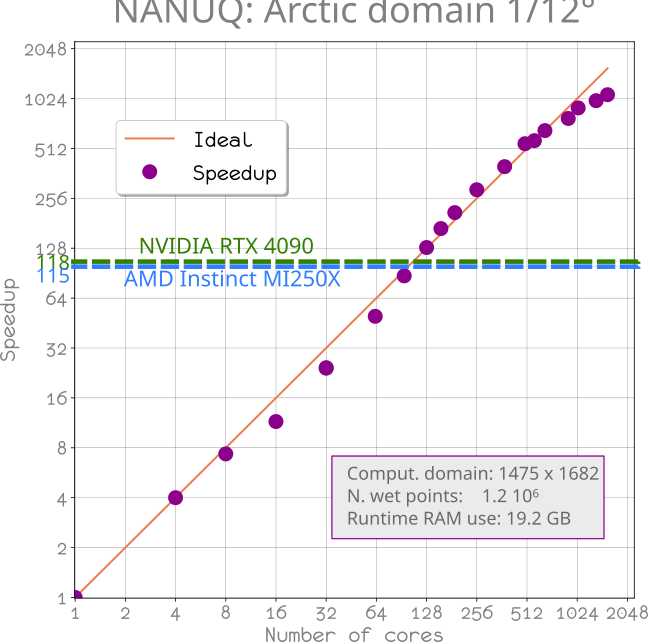
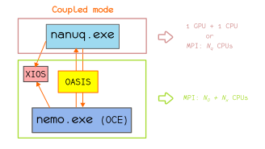
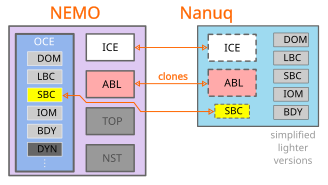

[](https://doi.org/10.5281/zenodo.21134373)


New: 4 extra global arrays `SI1t`, `SI2t`, `SI1f` & `SI2f` that store the first & second invariants of the vertically integrated stress tensors!


# NANUQ: a standalone GPU-optimized fork of NEMO/SI3 featuring brittle rheologies

NANUQ is a fork of SI3+SBC, i.e. the *sea-ice* and *ocean surface boundary conditions* components of NEMO version 5.

Put simply, NANUQ is a standalone executable that computes the surface fluxes required by a 3D ocean model as surface boundary conditions: momentum, heat, and freshwater. It can operate in the presence or absence of sea ice.

As part of this process, NANUQ resolves both sea-ice dynamics and thermodynamics. It can be used in two ways:

* **Standalone sea-ice experiments:** NANUQ is provided with prescribed surface states for both the liquid ocean and the atmosphere, supplied as netCDF files. A simple _slab ocean_ scheme acting on the heat and salt content of the ocean mixed-layer can be used (prescribed ocean MLD data must be provided along with ocean surface state).
* **Coupled ocean/sea-ice experiments:** NANUQ is provided with a prescribed surface atmospheric state (as a netCDF file) and receives the surface liquid-ocean state from an ocean model via OASIS. In return, NANUQ sends the surface fluxes of momentum, solar and non-solar heat, and freshwater (E−P) back to the ocean model via OASIS. These fluxes are provided as surface boundary conditions over **both ice-free and ice-covered regions**.

<p align="center">
  
</p>

With respect to the current version of SI3, NANUQ allows to use:
- brittle rheologies such as BBM & MEB, including the damage tracer  ([Dansereau _et al._, 2016](https://doi.org/10.5194/tc-10-1339-2016), [Òlason _et al._, 2022](https://doi.org/10.1029/2021MS002685)), implemented in SI3 by [Brodeau _et al._, 2024](https://doi.org/10.5194/gmd-17-6051-2024).
- the WENO advection scheme (for ice) of order 5 & 7, fully generalized for orthogonal curvilinear grids !
- 5th order symmetric WENO interpolation for remapping between the C-grid point (such as from center to corner grid points for example).
- an implicit RK3 numerical scheme for time integration of the brittle rheologies
- simple _slab ocean_ scheme (for heat and salt) for standalone sea-ice simulations


<br>

## Why NANUQ?
Technically, NANUQ is the equivalent of the SAS (StandAlone Surface) configuration of NEMO. Like SAS, it can be run either in standalone mode, using a prescribed surface state of the liquid ocean, or coupled to OCE—the 3D, liquid-ocean-only component of NEMO—via OASIS.

We believe in modularity, and the SI3 sea-ice component is too valuable to be accessible only through the vast and potentially intimidating NEMO ecosystem. NANUQ aims to make SI3 **accessible, usable, and easily tweakable** as a standalone sea-ice component, without requiring users to navigate the full NEMO code base.

To achieve this, NANUQ removes unnecessary source code, dependencies, memory allocations, and run-time operations inherited from SAS.

When using SI3 (or, more precisely, SAS) as a standalone *sea-ice-only* component, users may encounter the following limitations:

* **Source-code dependencies:** SI3 depends on numerous NEMO modules that are specific to the liquid ocean. As a result, using SI3 in standalone mode through SAS requires compiling the entire NEMO source code.
* **Unnecessary memory usage and computations:** SAS allocates many 3D and 2D arrays that are specific to the liquid ocean and performs ocean-specific operations that are unnecessary for a standalone sea-ice model. This significantly increases memory usage compared with NANUQ.

A standalone sea-ice GCM such as NANUQ, with the liquid-ocean code removed, is also particularly well suited to porting and optimizing the sea-ice model for GPUs.

NANUQ's ability to run efficiently on a single GPU enables the use of hybrid HPC nodes for coupled ocean–sea-ice experiments, with NANUQ running on a GPU and the OCE component of NEMO running on CPU cores using MPI, coupled through OASIS.

<br>

## About GPU offloading

NANUQ can efficiently offload computations to a single GPU using either OpenACC or OpenMP directives. The code is primarily tested with NVIDIA's `nvfortran` compiler and AMD's `amdflang` compiler (ROCm 7.2).

<p align="center">
  
</p>

_Speedup of NANUQ standalone on the high-resolution Arctic domain at 12<sup>th</sup> of a degree obtained with: increasing number of AMD Genoa EPYC 9654 / 2.4 GHz cores in parallel (dots), one NVIDIA RTX 4090 (OpenACC) + one CPU core (green line), and one AMD Instinct MI250x (OpenACC) + one CPU core (blue line)._

OpenACC directives are hardcoded directly in the source code and serve as the reference GPU programming model. For OpenMP, a dedicated script automatically translates the OpenACC directives into their OpenMP counterparts (see the section on **"Automatic translation to OpenMP"**). They are used in combination with the `_OPENACC` or `_OPENMP` pre-processing keys, respectively.

The decision to use OpenACC as the reference directive model is mainly motivated by its GPU-specific nature, whereas OpenMP is a broader, rapidly evolving standard that targets both CPUs and accelerators. Keeping OpenACC as the source directives therefore provides a stable and GPU-focused basis from which OpenMP directives can be generated automatically.

Since sea ice is two-dimensional with respect to the ocean, most of NANUQ's arrays are 2D. This results in a relatively modest memory footprint, allowing all arrays to remain resident in GPU memory throughout the computation. Consequently, communication between the CPU and GPU is kept to a minimum and is limited to initialization, I/O (atmospheric and ocean forcing, output, etc.), and restart reading/writing.
Apart from these operations, **all computations are performed on the GPU**.

<p align="center">
  
</p>


<br>

## Code architecture under `src/`

Remaining from NEMO:
- `BDY` lateral open boundary conditions for sea-ice
- `DOM` spatial domain/grid...
- `ICE` sea-ice model (ex SI3)
- `IOM` XIOS I/O interface
- `LBC` horizontal MPI partitioning of the computation domain...
- `SBC` surface boundary conditions for sea-ice and liquid ocean
- `ABL` atmospheric boundary layer

<p align="center">
  
</p>


New / renamed:
- `OSS`: Ocean Surface State stuff, provides the fields (prescribed or coupled) that serve as bottom boundary conditions for the sea-ice model and/or are used to compute air-sea fluxes over open (liquid) ocean
- `RMP`: horizontal remapping between the _Arakawa_ C-grid points (including WENO5-centered scheme) 
- `sbcssm.F90` has become `ossssm.F90` (read a prescribed surface state of the ocean: SST, SSS, SSH, SSU, SSV, etc)
- `osscpl.F90` (new) a version of `sbccpl.F90` dedicated only to the OSS coupling realm...

<br>

## Compilation of the "nanuq.exe" executable

As of now, this guide is written for someone familiar with the compilation of NEMO.

Just as for NEMO, compilers, compilation flags, MPI paths, as well as the path to the XIOS2 library and executables must be defined in the `arch/arch-<ARCH>.fcm` (standalone executable) or in the `arch/arch-<ARCH>_OA3.fcm` (coupled executable).
`<ARCH>` being the string that identifies the host on which NANUQ is compiled.

### For standalone simulations

Compilation of a `nanuq.exe` executable that will require a prescribed surface (liquid) ocean state to be provided as netCDF files.

To compile the executable:

``` ./makenanuq -m <ARCH> -r generic -j 4```

Executable created: `cfgs/generic/BLD/bin/nanuq.exe`


### For coupled simulations with OASIS-MCT

Compilation of a `nanuq.exe` executable that is intended to receive the prognostic surface (liquid) ocean computed by an OGCM and send back surface boundary conditions to this OGCM.

First, you need to have a XIOS2 installation that has been compiled with OASIS-MCT support. So the first thing to compile is OASIS-MCT!

Note:
In coupled mode, the OGCM receives the `E-P` freshwater flux from NANUQ, the contribution from continental runoffs is something the OGCM has to handle itself.
With OCE of NEMO: `ln_rnf=T` and the `namsbc_rnf` namelist block filled, with a netCDF runoff climatology provided...

#### Install OASIS3-MCT

```git clone https://gitlab.com/cerfacs/oasis3-mct.git```
`...`

#### install XIOS2 trunk
Then, compile XIOS2 with OASIS support:
```svn co http://forge.ipsl.jussieu.fr/ioserver/svn/XIOS2/trunk xios2-trunk_oa3```

Adjust your `arch/arch-<ARCH>_OA3.fcm` with the paths to OASIS and this OASIS-linked XIOS.


#### compile the `nanuq.exe`

``` ./makenanuq -m <ARCH>_OA3 -r generic_cpl_oce -j 4```

Executable created: `cfgs/generic_cpl_oce/BLD/bin/nanuq.exe`


### Compilation on the GPU

Your Fortran compiler needs to support your GPU hardware. We have successfully tested NANUQ on both NVIDIA and AMD GPUs using recent versions of `nvfortran` from the NVIDIA HPC SDK and `amdflang` from AMD's LLVM-based ROCm suite.

For the compiler options, you can refer to the following tested reference architecture files:

* NVIDIA OpenACC: `arch/arch-TEMPLATE-NVIDIA-OACC.fcm` (NVIDIA RTX 4090, NVIDIA HPC SDK)
* NVIDIA OpenMP: `arch/arch-TEMPLATE-NVIDIA-OMP.fcm` (NVIDIA RTX 4090, NVIDIA HPC SDK)
* AMD ROCm OpenMP: `arch/arch-TEMPLATE-ROCm-OMP.fcm` (AMD Instinct MI250x, AMD ROCm 7.2.0, OpenMPI 5)

**Note:** netCDF, XIOS, OASIS, MPI, etc. must also be compiled with the appropriate compiler suite.

#### Compile for OpenACC

As mentioned above (*About GPU offloading*), OpenACC directives are the default offloading directives used in the NANUQ source code. Therefore, compiling NANUQ only requires using the appropriate GPU OpenACC compilation flags for your hardware.

#### Compile for OpenMP

First, all NANUQ source files under `./src` featuring OpenACC directives are translated for OpenMP using a set of Bash scripts. The translated files are saved under `./cfgs/generic/MY_SRC/` or `./cfgs/generic_cpl_oce/MY_SRC/`.

The script to use is `./PREPARE_OMP_SRC.sh`. The `VERSION_OMP` variable in this script specifies the OpenMP version to target. Use `VERSION_OMP=5.1` for recent ROCm compilers and `VERSION_OMP=4.x` for NVIDIA compilers.

For example, to prepare the standalone version of NANUQ treating 16 files at a time (uses 16 CPU cores):

```bash
./clean_all.sh all
./PREPARE_OMP_SRC.sh generic 16
```

This produces a `./<source>.F90.log` report for each translated `<source>` file. You can easily check for errors with:

```bash
cat *.log | grep -i error
```

All translated source files can be found under `./cfgs/generic/MY_SRC`.

You can now compile NANUQ using the appropriate GPU OpenMP compilation flags for your hardware.


<br>

<br>

## Getting started with NANUQ

Download the archive containing input and forcings for the test-cases [here](https://ige-meom-opendap.univ-grenoble-alpes.fr/thredds/fileServer/meomopendap/extract/SASIP/model-forcings/nanuq/INPUT_NANUQ_DISTRIB.tgz).

And extract it somewhere...

`tar zxvf INPUT_NANUQ_DISTRIB.tgz`

If you plan to test the HUDSON12 setups (standalone or coupled to OCE of NEMO), also download the atmospheric forcing:
[here](https://ige-meom-opendap.univ-grenoble-alpes.fr/thredds/catalog/meomopendap/extract/SASIP/model-forcings/nanuq/ERA5-HUDSON12/catalog.html) (16 GiB!).
<br>
It is the 1-hourly ERA5 surface atmospheric forcing for 1997 interpolated on the HUDSON12 domain, 1 netCDF file per atmospheric variable.

Similarly, for the EGL12 setups, the required atmospheric forcing files can be downloaded [here](https://ige-meom-opendap.univ-grenoble-alpes.fr/thredds/catalog/meomopendap/extract/SASIP/model-forcings/atmo_forcing/ERA5_Arctic/catalog.html).

<br>

## Standalone mode (sea-ice-only) configurations

By increasing order of realism/complexity...

### The `ROTATION` 2D-advection-only idealized test case
This test-case is dedicated to the comparison of the various
horizontal advection schemes available in NANUQ, namely _SOM (aka
Prather)_, _WENO 7th order_ & _Ultimate Macho 5th order_.  A circular
patch of sea-ice is advected by a cyclonically-rotating prescribed
analytical horizontal velocity field.

Both thermodynamics and rheology components of NANUQ are deactivated
in such an idealized 2D-advection-only setup (`ln_dynADV2D=.true.` in the
NANUQ ice `&namdyn` namelist block).

<p align="center">
  
</p>

_Advection of a 30 cm thick circular patch of ice on a 500 km wide
domain during 90 days (field shown: ice thickness; max velocity of the cyclonic vortex: 0.25 m/s)
at 2 km of resolution. SOM (Prather) scheme [left] and WENO 7
[right]._


<br>


<p align="center">
  
</p>

_Same after 5 months of simulation._

See the dedicated [README](./tests/TEST-CASES/ROTATION/README.md) under `./tests/TEST-CASES/ROTATION/`.


<br>


### The `CYCLONE` idealized test case
Test-case of Melhmann _et al._, 2021.

This test case, defined on a 512 km wide square domain, simulates a
cyclone traveling in the northeastward direction over a thin layer of
ice (h ≃ 0.3 m) that floats on an anticyclonically circulating
ocean. This test case is well suited to illustrate the influence of
the grid discretization on rheology-related processes such as the
representation of linear kinematic features (LKFs)

<p align="center">
  
</p>

_Evolution of the sea ice concentration during 3 days at 2 km of resolution using 2 different sea-ice rheologies: aEVP (default in SI3) [left] and the BBM brittle rheology [right]._

See the dedicated [README](./tests/TEST-CASES/CYCLONE/README.md) under `./tests/TEST-CASES/CYCLONE/`.


<br>

### The `CHANNELD17` idealized test case

Test-case of Dansereau _et al._, 2017. An idealized setup of the Nare straight under vigorous northerly wind forcing.

<p align="center">
  
</p>

_Evolution of the sea ice thickness (initially 1 m) during 10 days at 2 km of resolution under constant northerly wind forcing of 20 m/s._


See the dedicated [README](./tests/TEST-CASES/CHANNELD17/README.md) under `./tests/TEST-CASES/CHANNELD17/`.


<br>


### The `HUDSON12` (sea-ice only) realistic test case

Regional configuration of the HUDSON bay at 12th of a degree of spatial resolution (extracted from eORCA12).

<!--
<p align="center">
<video width="225" controls>
<source src="https://github.com/user-attachments/assets/5507bdc9-aee2-4ba9-bc75-115abc1fac31" type="video/mp4">
</video>
</p>
-->

https://github.com/user-attachments/assets/08c848fe-4d7a-4f3a-93f5-6dd61db39f01

_Evolution of the sea ice thickness (range: 0 - 3m), 1996-11-01 to 1997-05-20 with the aEVP (left) and the BBM (right) rheologies in the HUDSON12 coupled setup (NANUQ - OASIS -NEMO/OCE) with hourly ERA5 surface atmospheric forcing. Initialized 1996-11-01 with GLORYS2v4 reanalysis._


https://github.com/user-attachments/assets/5507bdc9-aee2-4ba9-bc75-115abc1fac31

_Evolution of the sea ice damage during 60 days with the BBM rheology (January & February 1997) in HUDSON12 with hourly ERA5 surface atmospheric forcing._

See the dedicated [README](./tests/TEST-CASES/HUDSON12/standalone/README.md) under `./tests/TEST-CASES/HUDSON12/standalone`.


<br>


### The `EGL12` (sea-ice only) realistic test case under prescribed (open) lateral boundary conditions (BDY)

Regional configuration of the East-Greenland region at 12th of a degree of spatial resolution (extracted from eORCA12).

https://github.com/user-attachments/assets/02d6799b-6e82-47bc-95cd-03e54171d8f8

_Evolution of the sea ice thickness (range: 0 - 4m), 1997-01-01 to 1997-04-25 with the BBM rheology in the EGL12 coupled setup (NANUQ - OASIS -NEMO/OCE) with hourly ERA5 surface atmospheric forcing. Initialized 1997-01-01 with GLORYS2v4 reanalysis. White rectangular area are disregarded processors regions (MPI horizontal decomposition)._

See the dedicated [README](./tests/TEST-CASES/EGL12/standalone/README.md) under `./tests/TEST-CASES/EGL12/standalone`.


<br>


## NANUQ coupled to OCE of NEMO

### The HUDSON12 (ocean/sea-ice coupled) realistic test case
See the dedicated [README](./tests/TEST-CASES/HUDSON12/cpl_oce/README.md) under `./tests/TEST-CASES/HUDSON12/cpl_oce`.

### The EGL12 (ocean/sea-ice coupled) realistic test case with prescribed (open) lateral boundary conditions
See the dedicated [README](./tests/TEST-CASES/EGL12/cpl_oce/README.md) under `./tests/TEST-CASES/EGL12/cpl_oce`.


<br>


## Stuff not yet implemented in SI3 (NEMO v5)

 - bulk transfer coefficients for sea-ice / atmosphere turbulent fluxes estimates (`C_D`, `C_H` & `C_E`), depend on atmospheric surface boundary layer stability (using stability function of Grachev _et al._ 2007 in stable SBL within a _Monin-Obukov_-based iterative algorithm)


<br>


<br>

Remember my friend (totally out of context but important):

    ! * jperio= 0, landlocked
    ! * jperio= 1, CYCLIC east-west
    ! * jperio= 2, equatorial symmetric (i.e. CYCLIC north-south)
    ! * jperio= 3, north fold WITH T-point pivot
    ! * jperio= 4, CYCLIC east-west and north fold WITH T-point pivot
    ! * jperio= 5, north fold WITH F-point pivot
    ! * jperio= 6, CYCLIC east-west and north fold WITH F-point pivot
    ! * jperio= 7, CYCLIC east-west and north-south
